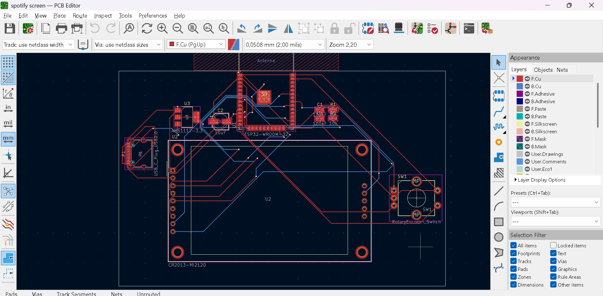
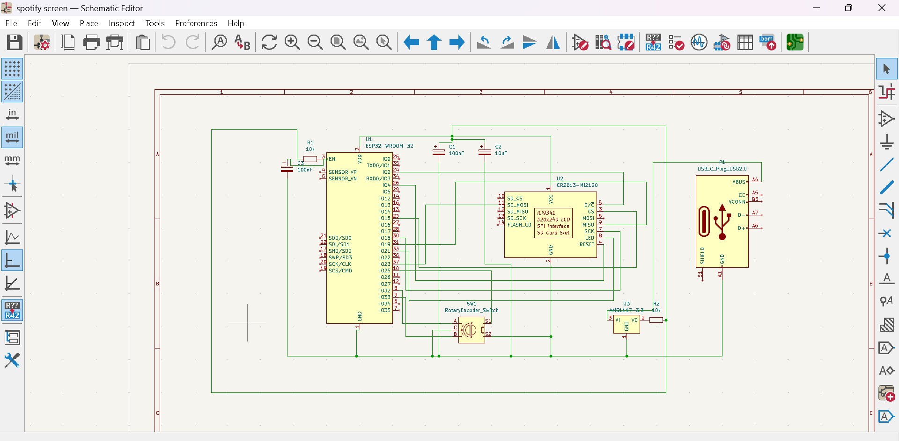

# ESP32 Spotify Remote Controller

A custom ESP32-based hardware controller featuring an ILI9341 TFT display and a rotary encoder to wirelessly control Spotify playback over Wi-Fi.

## Quick start
1. Clone this repository and open the file in the `firmware` folder using Arduino IDE.
2. Install the required libraries (`TFT_eSPI`, `ESP32Encoder`, `SpotifyEsp32`).
3. Update your Wi-Fi credentials (`ssid`, `password`) and Spotify API credentials (`clientId`, `clientSecret`) in the code.
4. Upload the code to your ESP32 board and connect power via USB-C.

## Features
* **Spotify Integration:** Uses `SpotifyEsp32` to control playback (Next/Previous track, Play/Pause).
* **Rotary Encoder Controls:** Turn the knob (GPIO 25, 26) to skip tracks and press the button (GPIO 27) for play/pause.
* **TFT Display:** ILI9341 320x240 screen driven by `TFT_eSPI` for status and track updates.
* **Hardware:** Custom PCB with an ESP32-WROOM-32 module, USB-C interface, and onboard AMS1117 3.3V power regulation.

## How it works
The project runs on an ESP32-WROOM-32 microcontroller. Upon boot, it connects to Wi-Fi and initializes the ILI9341 display. The `ESP32Encoder` library handles the rotary encoder inputs to trigger Spotify API calls (`spotify.nextTrack()`, `spotify.previousTrack()`) over a secure Wi-Fi client (`WiFiClientSecure`).

## 💰 Bill of Materials (BOM)
"Id","Designator","Footprint","Quantity","Designation","Supplier_and_ref"
1,"U1","ESP32-WROOM-32",1,"ESP32-WROOM-32 SMD Module","TME RO: https://www.tme.eu/ro/details/esp32-wroom-32/module-wifi/espressif/"
2,"R2,R1","R_0805_2012Metric",2,"10k","Electronic Mag: https://electronic-mag.ro/p/65385-set-rezistoare-smd-0805-5-10o-1mo-0o-nrval-121"
3,"C2","CP_Elec_5x5.4",1,"10uF","Ardushop: https://ardushop.ro"
4,"U3","SOT-223-3_TabPin2",1,"AMS1117-3.3","Sigmanortec: https://sigmanortec.ro/en/ams1117-33v-step-down-module"
5,"SW1","RotaryEncoder_Alps_EC11E",1,"RotaryEncoder_Switch","Sigmanortec: https://sigmanortec.ro/en/rotary-encoder-with-click-20mm-ec11"
6,"P1","USB_C_Receptacle",1,"USB_C_Plug_USB2.0","Mouser RO: https://ro.mouser.com/ProductDetail/GCT/USB4731-GF-A"
7,"C3,C1","C_0805_2012Metric",2,"100nF","Lampatronics: https://lampatronics.com/product/smd-multilayer-ceramic-capacitor-0805-2012-104-100nf-50v-1pcs-2"
8,"U2","CR2013-MI2120",1,"ILI9341_TFT","Drot RO: https://www.drot.ro/platforma-arduino/909-ecran-tactil-2-4-240x320-spi-tft-ili9341.html"
