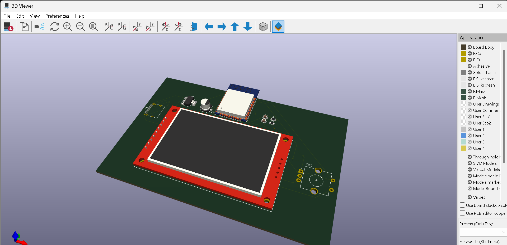

# ESP32 Spotify Remote Controller

A custom ESP32-based hardware controller featuring an ILI9341 TFT display and a rotary encoder to wirelessly control Spotify playback over Wi-Fi.

## Quick start
1. Clone this repository and open the file in the `firmware` folder using Arduino IDE.
2. Install the required libraries (`TFT_eSPI`, `ESP32Encoder`, `SpotifyEsp32`).
3. Update your Wi-Fi credentials (`ssid`, `password`) and Spotify API credentials (`clientId`, `clientSecret`) in the code.
4. Upload the code to your ESP32 board and connect power via USB-C.

## Features
* **Spotify Integration:** Uses `SpotifyEsp32` to control playback (Next/Previous track, Play/Pause).
* **Rotary Encoder Controls:** Turn the knob (GPIO 25, 26) to skip tracks and press the button (GPIO 27) for play/pause.
* **TFT Display:** ILI9341 320x240 screen driven by `TFT_eSPI` for status and track updates.
* **Hardware:** Custom PCB with an ESP32-WROOM-32 module, USB-C interface, and onboard AMS1117 3.3V power regulation.

## How it works
The project runs on an ESP32-WROOM-32 microcontroller. Upon boot, it connects to Wi-Fi and initializes the ILI9341 display. The `ESP32Encoder` library handles the rotary encoder inputs to trigger Spotify API calls (`spotify.nextTrack()`, `spotify.previousTrack()`) over a secure Wi-Fi client (`WiFiClientSecure`).
